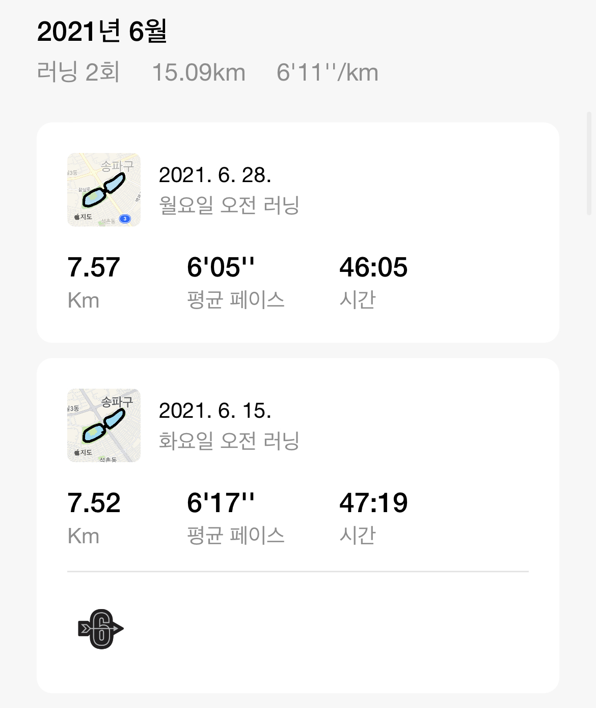

# running 👟

꾸준함, 성실함이 제 특기입니다.

* ## 2021년
	*  [1월](https://github.com/mingeun2154/running#2021%EB%85%84-1%EC%9B%94)
	*  [2월](https://github.com/mingeun2154/running#2021%EB%85%84-2%EC%9B%94)
	*  [3월](https://github.com/mingeun2154/running#2021%EB%85%84-3%EC%9B%94)
	*  [4월](https://github.com/mingeun2154/running#2021%EB%85%84-4%EC%9B%94)
	*  [5월](https://github.com/mingeun2154/running#2021%EB%85%84-5%EC%9B%94)
	*  [6월](https://github.com/mingeun2154/running#2021%EB%85%84-6%EC%9B%94)
	*  [7월](https://github.com/mingeun2154/running#2021%EB%85%84-7%EC%9B%94)
	*  [10월](https://github.com/mingeun2154/running#2021%EB%85%84-10%EC%9B%94)
* ## 2022년
	* [1월](https://github.com/mingeun2154/running#2022%EB%85%84-1%EC%9B%94)
	* [2월, 3월](https://github.com/mingeun2154/running#2022%EB%85%84-2%EC%9B%94-3%EC%9B%94)
	* [5월](https://github.com/mingeun2154/running#2022%EB%85%84-5%EC%9B%94)

# 

## 2021년 1월
 

## 2021년 2월

# 2021년 3월

# 2021년 4월

# 2021년 5월

# 2021년 6월

# 2021년 7월

# 2021년 10월

#

# 2022년 1월

# 2022년 2월, 3월

# 2022년 5월

