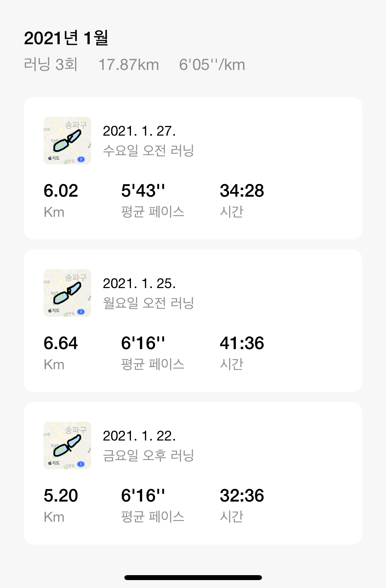
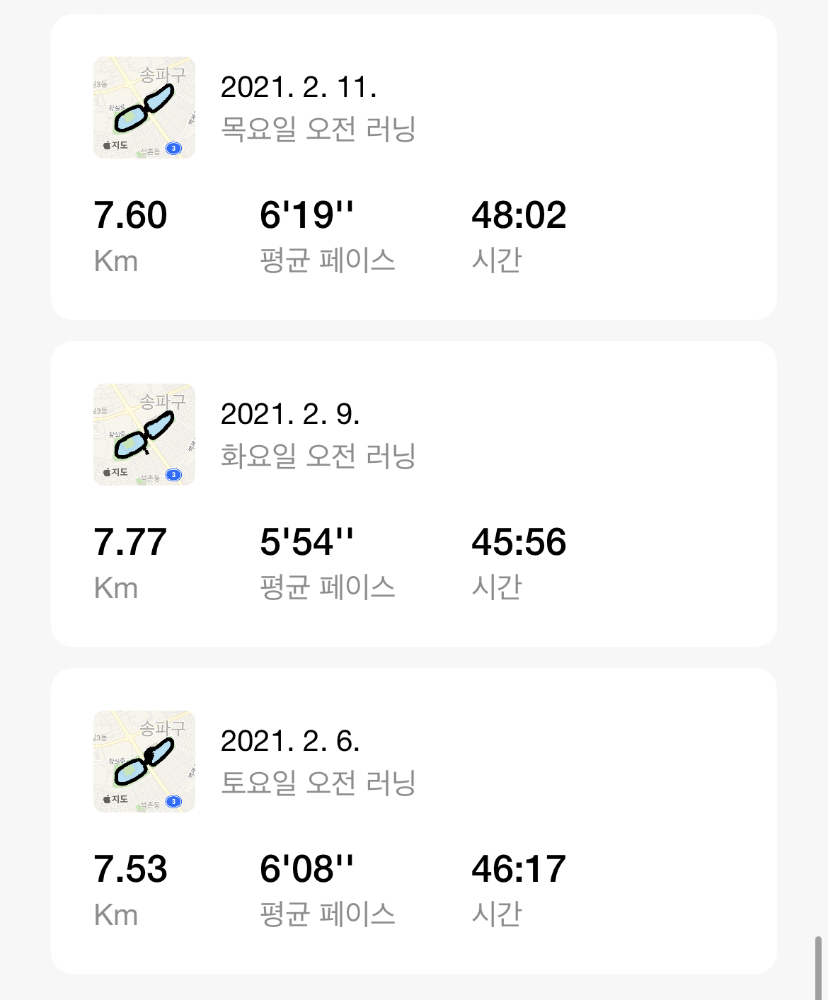
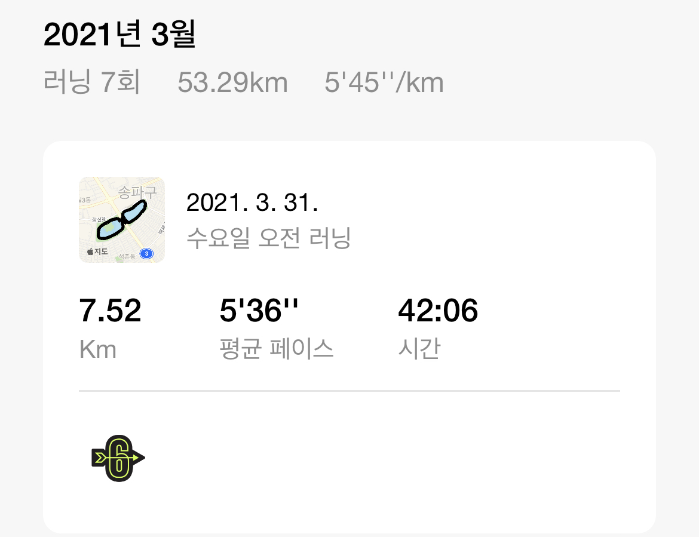
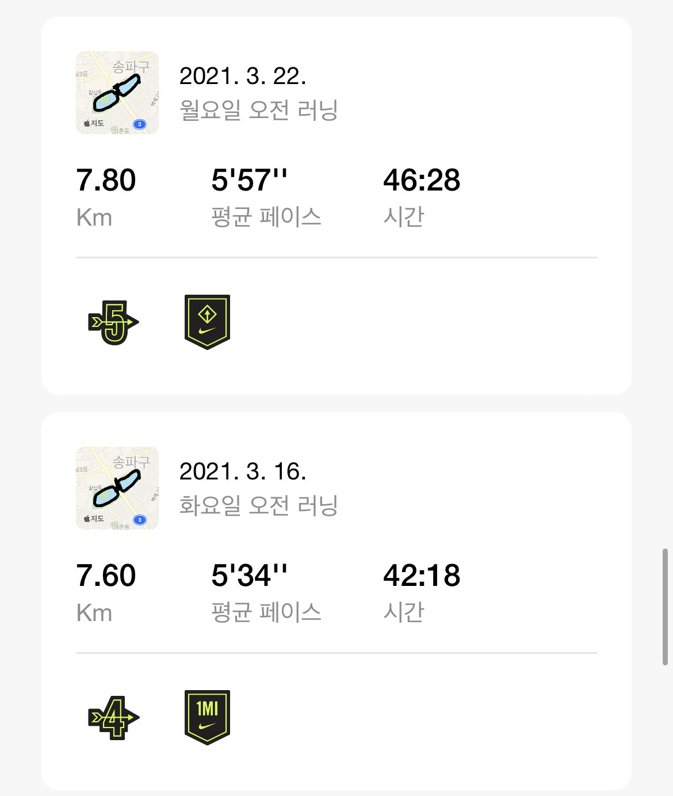
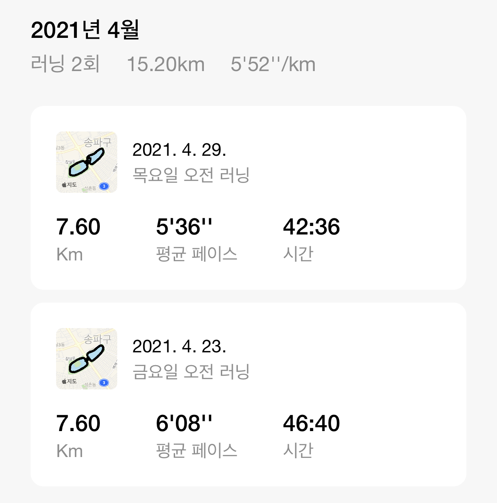
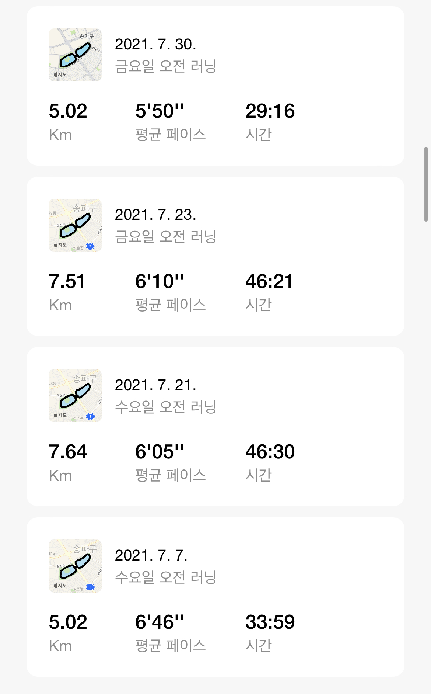
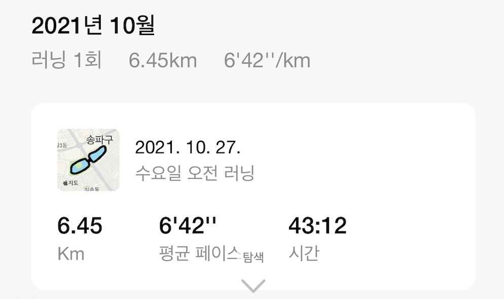
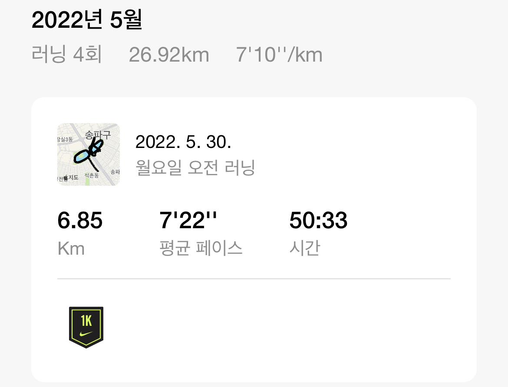

# running 👟

* ## [2021년](#)
	*  [1월](#)
	*  [2월](#)
	*  [3월](#)
	*  [4월](#)
	*  [5월](#)
	*  [6월](#)
	*  [7월](#)
	*  [10월](#)
* ## [2022년](#)
	* [1월](#)
	* [2월, 3월](#)
	* [5월](#)

# 

## 2021년 1월
 

## 2021년 2월

# 2021년 3월

# 2021년 4월

# 2021년 5월

# 2021년 6월

# 2021년 7월

# 2021년 10월

#

# 2022년 1월

# 2022년 2월, 3월

# 2022년 5월

